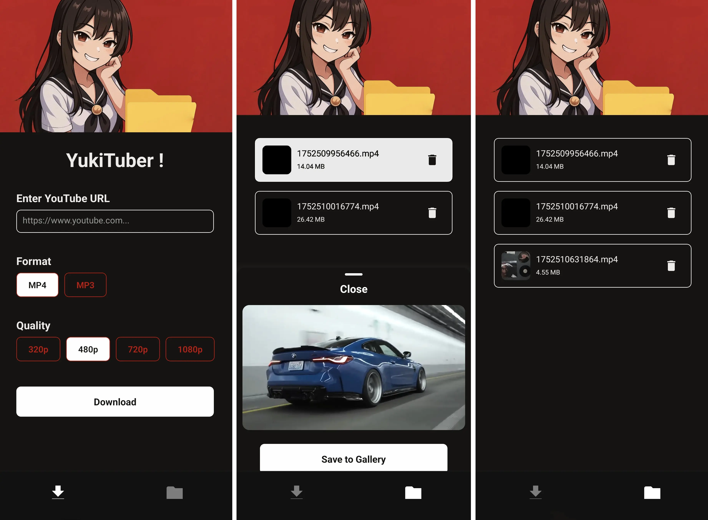

# YukiTuber




It is a mobile application for downloading YouTube videos (mp4) and audio (mp3) directly to your device. It features a simple interface for pasting YouTube URLs and managing your downloaded media.

## Features

- Download YouTube videos in MP4 format.
- Extract and download audio in MP3 format.
- Select video quality (480p, 720p, 1080p).
- View and manage downloaded files within the app.
- Play downloaded videos.
- Save videos to your device's gallery.
- Handles YouTube URLs shared to the app.

## Tech Stack

### Frontend (React Native with Expo)

- **Framework:** React Native with Expo
- **State Management:** React Context
- **File System:** Expo File System
- **Media Library:** Expo Media Library

### Backend (Bun)

- **Framework:** Hono
- **Runtime:** Bun
- **YouTube Downloader:** `yt-dlp`
- **Validation:** Zod

### Monorepo Management

- **Tool:** Turborepo
- **Package Manager:** Bun

## Getting Started

### Prerequisites

- [Bun](https://bun.sh/) installed on your machine.
- [Node.js](https://nodejs.org/) (for some Expo dependencies).
- [Expo Go](https://expo.dev/go) app on your mobile device for testing.
- [yt-dlp](https://github.com/yt-dlp/yt-dlp) Make sure yt-dlp is installed in your system

### Installation & Running

1. ```bash
    git clone <repository-url>
    cd yukituber
    ```

2.  ```bash
    bun install
    ```

3.  ```bash
    bun run dev
    ```
It will start the Turborepo!

Feel free build and run the docker image of backend provided into repo

## Project Structure

The project is a monorepo managed by Turborepo.

```
/
├── apps/
│   ├── backend/      # Hono backend server
│   └── frontend/     # React Native (Expo) mobile app
├── package.json      # Root package.json
├── Dockerfile        # For server only
└── turbo.json        # Turborepo configuration
```

The things i learned from this project are docker, aws shie and streaming data.

## Warning

Downloading youtube content using yt-dlp or any other why, is stricktly against youtubes policy, that's the reason this application is just for learning purposes and the server is not deplyed to VPS.

Pinky promis, not like i tried deplying to aws anyways. I had actully it's just they know what i'm doing so....

If you want to do something similar, use proxy servers or home server to host it.

## License

This project is licensed under the **MIT License**. See the [LICENSE](LICENSE) file for details.

---

Made with <3 by [Sameer Gupta](https://github.com/SamTheTechi)
